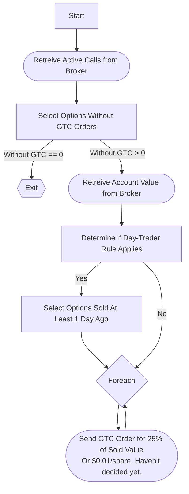

# Penny V4

## TL;DR

Penny is a trading bot that will sell weekly [covered calls](https://www.investopedia.com/terms/c/coveredcall.asp) and [cash-secured puts](https://www.investopedia.com/terms/n/nakedput.asp).

## New monorepo and tech stack!!!

Penny is now being converted into a monorepo and will be rewritten in TypeScript. Penny and Penny-Data had a ton of code that was not easily shared. I found myself copying and pasting a bunch of code. As the apps grew it became more difficult to keep them updated and in general was not good practice. I've also decided to convert the project to TypeScript.

## Legal Stuff

By using Penny or any software that may be derived from Penny for your own portfolio you agree to the following:

- I, the author, am not responsible for any damages you will definitely suffer caused by this program or any derivatives thereof.

- This readme and the code itself will be used for education purposes only. The kind of education you get from an underfunded community college taught by a professor who faked his credentials to get hired and lost his entire 401k daytrading Gamestop in a manner befitting the r/WallStreetBets hall of fame.

- Any of my personal success with either the program or strategies I use that I share in this readme shall not be construed as a guarantee of success.

- You acknowledge and accept that this program was conceived and written by an idiot with no financial background whatsoever and less than 10 ~~unsuccessful~~ years of trading experience.

If you use this program on a real account you will lose money. <- This is financial advice.

## Terms That I Probably Defined Incorrectly

- **Option**: A contract to buy or sell 100 shares of stock at a certain strike on or before the expiration date. The Europeans do it slightly differently but Europe doesn't matter.

- **Underlying**: Stonk.

- **Strike**: The price where the buyer and seller agree to exchange the shares, regardless of the current market price.

- **Premium**: Tendies received from selling an option.

- **Call**: An option where the buyer agrees to buy 100 shares of a stock if the price reaches above the strike on expiration.

- **Put**: An option where the buyer agrees to sell 100 shares of a stock if the price falls below the strike on expiration.

- **Delta**: Not even going to try. But for our purposes the delta is essentially the probability that the stock will reach a certain price on expiration. Not really, but kinda. A 0.30 delta is where the smart people say there's a good balance between risk and reward as it represents a 70% chance of the option expiring worthless.

- **Theta**: Also known as **Theta Decay**. This is the rate at which the option loses value. Typically, theta decay starts off slow and exponentially speeds up around the 30-45 day mark. Never EVER buy options with a high theta unless you're cool with watching your money evaporate. Selling options around this time is a good idea though.

- **Implied Volatility**: No idea how this is derived, but this is how much the market expects the stock to move in either direction. IV is typically high when there is an unknown of some kind, like a pending earnings call or an economic pissing match with China. When IV is high, the options premium is high.

- **IV Rank**: Implied volatility will be different for every stock. Telsa's chart, for example, looks like an arrhythmic heart rate monitor. At&T has been hovering around the same price for a long time. What you want to focus on is IV Rank because that will tell you when implied volatility is higher or lower than normal for a particular stock. 50% or higher means that IV is higher than it's 52-week average. [Market Chameleon](https://marketchameleon.com/Overview/AAPL/IV/) is a good place to look... for a fee.

- **Covered Call**: A strategy where you own 100 shares of a certain stock and sell a call option to some r/WallStreetBets gambler. Ideally, the underlying stock would trade sideways up until expiration so you can keep both the premium and the shares. You can lose out on some tendies if the underlying skyrockets above the strike. Should only be attempted on blue chip stocks or index funds that you actually want to own long term. Don't go chasing high premiums. The premiums could be high but the underlying stock might be s***t that brokers will make fun of you for owning.

- **Naked Put**: Also known as a **Cash-Secured Put**. (EDIT: No it isn't. A naked put is different in that it doesn't require collateral but I'm leaving it as is because I made too many jokes about it) This is a strategy where you don't own the shares but have the money to buy them at whatever strike price you sell the option for. If you sell a put on AAPL for $147, your broker will hold on to $14,700 as collateral.

- **Assignment**: When an option executes and you fulfil your side of the contract to either buy or sell shares at the agreed upon price. This can be bad if the actual market price is way higher than the strike you have to sell the shares for. The buyer may choose to execute an option earlier than the expiration date, especially if a dividend is coming.

- **Buy to Close**: When you sell an option and buy the same option on the same underlying at the same strike back, thereby destroying the contract.

- **Day-Trade**: Where you buy and sell the same underlying or option with the same underlying within the same trading session.

- **Day-Trader Rule**: That stupid SEC rule that says an American brokerage won't allow any account with less than $25k to day-trade more than 3 times in a 5-day period. Really annoying but probably delayed the inevitable foreclosures of many r/WallStreetBets homes. You could get around this through the use of some shady overseas broker. But that might be illegal, idk. I wouldn't try your luck.

Learn more at https://www.youtube.com/channel/UCkcnYVAVZQOB-nXHechtXDg (NSFW but hilarious)
https://www.youtube.com/channel/UCfMiRVQJuTj3NpZZP1tKShQ (Slightly less NSFW but entertaining)
https://www.youtube.com/user/TDAmeritrade (SFW but not funny at all)

## History

TL;DR V1-V3 didn't work. V4 might. Mike and his imploded Robinhood account lived unhappily ever after.

The original version of Penny was written to take advantage of pump-and-dump schemes with Penny stocks, hence the name. The original version would sift through emails where scammers would promise +1000% profits and stocks trading at <$1. As the scheme goes, they would make a large purchase, encourage idiots (including 18yr old me) to purchase, and sell off after the price of the stock inflated. This in turn would leave the idiots holding the bag with large losses. Penny would detect, buy, and then (hopefully) sell after reaching decent gains (5% or better), but most of the time the stock would've already reached it's apex before Penny detected it and made a purchase. Worse yet, I was limited by the day-trader rule which required me to hold each position for at least 1 full trading day. Thankfully, I was smart enough to test the strategy with paper money.

V1.5 was written to remedy the late entry that Penny would make by shorting the stocks detected. I know, I know, not an incredible idea. The obvious problem with shorting is that loss potential is theoretically unlimited. Look at what happened with Gamestop! All those poor hedge fund managers waiting at the breadlines ='(. The second problem is that few brokers will have easy-to-borrow (ETB) shares of penny stocks available to trade. Due to the ETB problem, this strategy was limited to 3 or 4 different stocks per week. So the capital needed to make any kind of profit was much too high. However, this proved to be somewhat successful. I made ~$500 in my best week with an average of $200 but the unlimited risk kept me up at night. I only ran this for a month or so all the while watching the charts every 5 minutes instead of working, ready to change my identity and move to Azerbaijan if s**t went sideways.

V1.7 never left the paper account. In this version I opened up Penny to short larger stocks and ignore penny stocks because higher priced stocks were much more likely to be easy-to-borrow. Imagine if I had this running during the GME fiasco.

V2 and V3 focused on pre-market activity. V2 was still focused on penny stocks while V3 was opened up to higher-priced stocks. Polygon.io had a nifty endpoint that would show the largest gainers and largest losers with a 15-minute delay. I noticed that many of the stocks with huge pre-market gains would go on to increase in value once the market opened. However, I was still limited by the day-trader rule and the stocks actually had a 60% chance (based on my own successes, your mileage will vary) of continuing their climb after market open. Many dropped right back to where they started. Even with my paper account above $25k and the day-trader rule eliminated, this strategy proved to be a flat-profit strategy. The relative minority of losses outpaced the gains most of the time. Stop-losses actually decreased my win rate by over 10% because some of the winners would dip first and some of the r/WallStreetBets gamblers had some religious duty to buy the dip if it fell too fast.

On to V4. V4 will automate a strategy that I've been doing manually. This has been a successful strategy for me for a ~~long time~~ couple of months and it's relatively simple to implement programmatically. The market has been batsh*t since the rona began so the tendies will likely dilute once Jerome Powell's money printer calms down but it's still a good strategy used by people who actually know what they're doing.

## App Composition

Penny will be composed of two API's and one UI. Why? Cause. It's to address all of my security concerns. Endpoints exposed to the internet are exposed to risk. Even a health endpoint that simply returns "true" to let me know Penny is up and running is a little too much risk to take on for an app that I'm writing to handle real money. And I was stupid enough to make this public but I'd be pretty stupid to tell you a**holes what cloud service I'm using. But I also focused on cybersecurity for my Masters degree. I learned to do some scary sh*t.

The primary API, the piece of Penny that will run in a cloud environment, will be as isolated as I can make it. It will only initiate network calls; it won't be able to receive them so none of you can get my tendies. Thats the piece that will handle all of the actual trading. It will also post a timestamp to MongoDB every 10 or so minutes so I can verify it's alive.

The other app will be deployed on my home network away from the kind of people that managed to break into an old database of mine to leave a message extorting me for bitcoin =). Never leave default settings, folks. Not even the port number. That app will control all of the settings including a stock watchlist that I want Penny to work with. It will gather order information from the broker that I'll later use to calculate taxes, active positions, whatever data I want gathered and displayed in an accompanying UI written using React.

The UI will be the fun part. I plan on learning the D3 library to make graphs. It will show how much (estimated) tax I should be prepared to pay, the income generated on a weekly, monthly, and annual basis, and whatever else I want to show.

"But Mike! Won't your broker already have a lot of that stuff?" Yes. But I won't be able to see how much money I'm losing selling options amongst the noise of the ups and downs of whatever actual stocks I own. The broker may tell me I've lost $2000 in total account value yet made $1000 in realized gains through the options. Losses on stock value aren't real until I lock them in by selling. At least that's what I told myself in March 2020 to keep from going long rope. Diamond hands.

## Core Functions

You will need the [Mermaid](https://chrome.google.com/webstore/detail/github-%20-mermaid/goiiopgdnkogdbjmncgedmgpoajilohe?hl=en) Chrome extension to view the following diagrams.

### Sell Covered Calls

This function makes up the minimum viable product for Penny and it will run every day. Until the cash-secured puts function is written, Penny will simply write covered calls against whatever stocks the brokerage account has. It will look forward 2 weeks and pick the call that has the higher weekly percentage. If this weeks call sells for $100 but next weeks sells for $300, it makes more sense to sell the call expiring next week.

### Sell Naked Puts

Maybe. Sounds kind of illegal outside of Nevada.

The naked put functionality will come later. Penny will gather the options chains for each stock in the MongoDB watchlist and compare the current options prices of each. It will prioritize those with the best premium:collateral return. The benefit is that some stocks will experience higher implied volatility than others week to week, so it's best to choose the stocks that will fetch the highest premium for the money put up first. This function is the key to making Penny as automated as possible. If something gets assigned from a covered call, that cash will be utilized for the naked put strategy. If a put gets assigned, there's a new stock for the covered call function to play with. It's sort of like the [Wheel strategy](https://medium.com/mastering-options/how-to-use-the-options-wheel-strategy-5013c9938f4b) except Penny will be chasing higher premiums every week rather than focusing on an individual stock.

// TODO: Flowchart

### Buy to Close

An options value will (typically) move with the stock price. Sometimes the value will fall all the way down to $0.01/share ($1 total) before expiration. Why wait until expiration to save ourselves a single dollar? It is a good idea to buy-to-close the option for a buck to free up the shares/cash as collateral to sell another option the following week.

This could easily be a part of the Sell functions, but the problem is that options trades are considered day trades and subject to the day-trader rule.

This function will create a good-til-closed order (GTC) against every covered call and naked put sold. So that if/when the option reaches the GTC price, the broker will automatically close the position. Next time the Sell functions are executed, it will sell a brand new option and bring in more tendies.

### Tax Estimation

Uncle Sam wants his cut, so I'm going to write some functionality that will estimate how much ~~theft~~ taxes I'll have to pay on whatever I earn since I won't have the "luxury" of tax withholding. I will also have to consider the [Wash-Sale Rule](https://www.youtube.com/watch?v=R7OmiwjGsZE) rule. Or not. This is just an estimation.

## Brokers

### Alpaca

I used [Alpaca](https://alpaca.markets/) for past versions of Penny but they don't support options trading. At least for now. It's a shame because they built their platform for idiots like me to write bots and have awesome documentation. Once they support options trading, I will see about switching over.

### Robinhood

My membership in r/WallStreetBets requires me to consider Robinhood, but they don't offer a dedicated API. They probably use CORS so that only their own clients (UI clients) can use it. But even if they don't, I wouldn't want to use it because I'd have to reverse engineer their API. They have no documentation and all tradeable assets have a weird ID attached to them that means I couldn't hope to find for the options chain. They are off the table. Probably for the better. They don't even offer paper trading.

### Interactive Brokers

Interactive brokers does have [documentation](https://www.interactivebrokers.com/en/index.php?f=5041) for their API. They welcome bot writers but their documentation hurts my eyes so I haven't actually read through it yet.

### TD Ameritrade

They have documentation and also have endpoints for live market data, including the options chain. I have an API registered complete with a key. At the time of this writing I haven't played with it too much but their authentication model is a crapshoot. The API account is also separate from my brokerage so I have to figure out how to link them. The documentation isn't clear on how to do that. It's not clear on how to do anything.

### ETrade

ETrade actually has a really good amount of documentation complete with a developer page like TD. It looks like they put a lot more into their API than the others aside from Alpaca. They even have example API's including one written with Node. Update: I looked at their node example and it's dogshit. They do the same callback crap that TD does which doesn't work for a bot unless I want to manually authenticate every 3 hours. Kind of kills the point.

### Tradier

Now this looks interesting. I happened upon this from some youtube ad where the guy was selling a worthless course on algotrading for $3000 and Tradier was mentioned in one of the sample lessons. Maybe I should sell courses... They're an API-first broker like Alpaca, but unlike Alpaca they support options. Their option trade price is $0.35/contract which is cheaper than the others. There's also a $30/month option which lets me get past the $0.35/contract fee. I'd have to make around 85 options trades or more to make that worth it which I might end up running into later on. They also have a watchlist feature which might mean I won't have to use a database. Best of all they provide some awesome code samples including Go. Update: Tradier is who I went with. No stupid-ass auth callback or anything.
